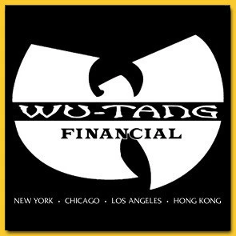

# Can't Hide Money Bot


A discord bot that manages your server's hedge fund



## Installing

Install [wkhtmltopdf](https://wkhtmltopdf.org/)

```
sudo apt-get install wkhtmltopdf
OR
brew install wkhtmltopdf
```

```
pip install -U git+https://github.com/kelvinabrokwa/cant-hide-money-bot.git
```

Create an env file like:

```
DISCORD_TOKEN='XXX'
DEV_GUILD_ID='XXX'
```

## Running

```
# Server
python -m cant_hide_money_bot.server --mode dev

# One-off report
python -m cant_hide_money_bot.report --mode dev
```

## Testing

```
make test
make lint
```

## About the app

Currently, we store the portfolio as a big list of trades like:

```python
class Trade:
    symbol: Symbol
    dir_: Dir
    qty: Qty
    time: datetime
    price: float
    trader: Trader
    guild: str
```

An empty portfolio has 0 USD and no positions. When you do a BUY trade, you get shorter USD and longer the security.
When you do a SELL trade, you get longer USD and shorter the security. Note that we capture market prices at execution
time in Trade to be able to calculate the value of the portfolio later.

## The Bot

On Discord

```
!help
```

```
~if you ain't talkin money i ain't talkin~

​No Category:
  $                Print portfolios per trader
  $$               Print portfolio for entire fund
  BUY              Buy some shares
  IM-FEELING-LUCKY Buy or sell a random quantity of a random symbol
  SELL             Sell some shares
  T                Print all trades made in this fund
  help             Shows this message

Type !help command for more info on a command.
You can also type !help category for more info on a category.
```

# Useful queries

```sql
select symbol, sum(qty * (case when dir == 'BUY' then 1 else -1 end)) from trades where trader = '<trader>' group by symbol;
```

